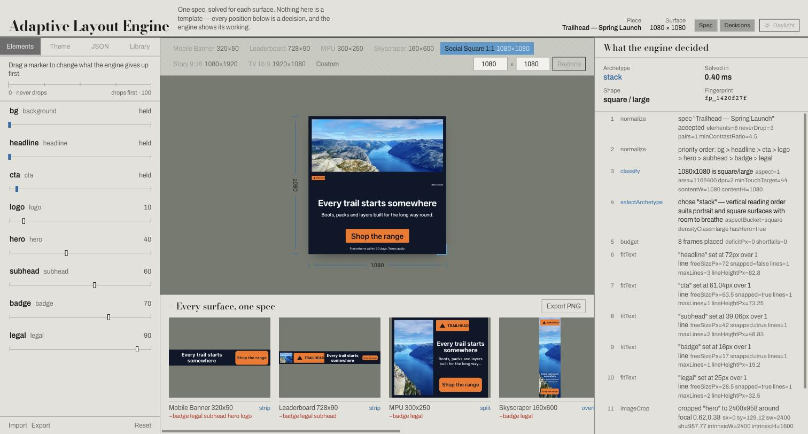
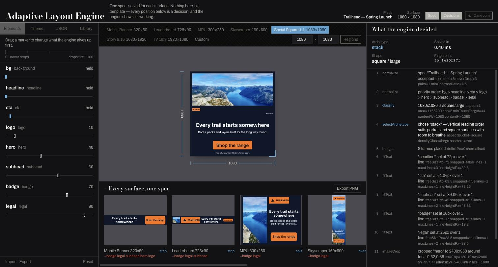
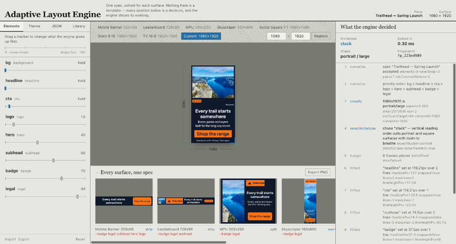

# Adaptive Layout Engine

**One ad spec. Any surface. No per-surface hand-authoring.**

A creative is authored once — elements, priorities, a theme, a few rules — and a constraint-based
engine decides, per surface, which elements survive, how they are arranged, how large the text is,
how images are cropped and how safe areas are respected. A 320×50 banner and a 9:16 story come out
of the same input, and the engine can tell you exactly why each one looks the way it does.

The engine is the deliverable. The app around it exists so you can watch it think.

| Daylight                                                  | Darkroom                                                      |
| --------------------------------------------------------- | ------------------------------------------------------------- |
|  |  |

The theme switch is in the masthead, next to the two panel toggles. It remembers your choice and
follows your OS preference until you make one.

- **Live demo:** _not deployed from this machine — see [Deployment](#deployment)._
  The no-login route is `/?demo=1`, which always loads the showcase spec.
- **Run it locally:** `npm install && npm run dev` (see [Local setup](#local-setup)).

---

## Free resize, live

Drag the corner of the canvas and the engine re-solves on every animation frame. Watch the
archetype change at the aspect boundaries, and elements strike through in the left rail with the
reason they were dropped.



---

## The algorithm

`solve(spec, surface)` runs ten steps in order. Every step appends to a trace, so the output
explains itself.

| #   | Step              | The decision it makes                                                                                      |
| --- | ----------------- | ---------------------------------------------------------------------------------------------------------- |
| 1   | `normalize`       | Validate with zod, resolve role defaults, order elements by priority. Priority 0 implies `neverDrop`.      |
| 2   | `classify`        | Aspect bucket, density class, minimum touch target, safe-area content box.                                 |
| 3   | `selectArchetype` | Pick a composition from an `(aspect × density)` table.                                                     |
| 4   | `budget`          | Weighted band allocation honouring `minSize` and `aspectLock`; reports a deficit when minimums do not fit. |
| 5   | `fitText`         | Binary-search the font size so greedily-wrapped text fits its region and `maxLines`.                       |
| 6   | `degrade`         | Drop the least important element and re-run 4–5 until it fits.                                             |
| 7   | `safeArea`        | Clamp frames inside the safe area; grow CTAs to the surface's touch target.                                |
| 8   | `imageCrop`       | Cover-fit crop that keeps the focal point in view.                                                         |
| 9   | `contrast`        | Enforce the WCAG floor by recolouring, or by adding a scrim.                                               |
| 10  | `fingerprint`     | Hash the visible outcome so golden tests can pin it.                                                       |

### Determinism as a design constraint

`solve()` is pure. No clock, no randomness, no DOM, no I/O. The same `(spec, surface)` produces a
byte-identical `LayoutResult` in Node and in the browser.

That is not a nicety — it is what makes three other things possible: golden tests that diff
decisions rather than screenshots, a server-side `/api/render` that cannot disagree with the client,
and a free-resize drag that can re-solve every frame without tearing. `tests/purity.test.ts` scans
the engine source for platform imports and spies on `Math.random` and `Date.now`;
`apps/api/tests/parity.test.ts` asserts server and client output match byte for byte.

### The four archetypes

An archetype is a named opinion about how a family of surfaces should be composed. It answers two
questions and nothing else — what regions exist, and which element goes in which one. All sizing
happens in `budget` and `fitText`.

| Archetype | Chosen for               | Why                                                                                                                         |
| --------- | ------------------------ | --------------------------------------------------------------------------------------------------------------------------- |
| `strip`   | micro, and all ultrawide | A single row is the only composition that fits when height is the scarce axis.                                              |
| `split`   | landscape                | Width to spare and height to protect, so the hero sits beside the copy and the type stays readable at TV distance.          |
| `stack`   | square and portrait      | Vertical reading order, hero on top. The default, and what the others are measured against.                                 |
| `overlay` | tall with a hero         | A very tall canvas cannot afford to divide image from type, so the type sits on the image and step 9 puts a scrim under it. |

**A note on the thresholds.** With the specified aspect buckets a 9:16 story is `0.5625`, which
lands in **portrait**, not `tall`. `tall` (< 0.45) is skyscraper territory — 160×600 and narrower.
So `overlay` serves skyscrapers, and stories compose with `stack`. That follows from the brief's own
numbers; it is called out here rather than quietly widened.

---

## Worked example: one spec, from a story to a banner

The showcase spec has eight elements and this priority ladder:

| Element    | Priority | Rule                                                                    |
| ---------- | -------: | ----------------------------------------------------------------------- |
| `bg`       |        0 | held (priority 0 implies never-drop)                                    |
| `headline` |        0 | held, and named in `neverDrop`                                          |
| `cta`      |        5 | held, and named in `neverDrop`                                          |
| `logo`     |       10 |                                                                         |
| `hero`     |       40 |                                                                         |
| `subhead`  |       60 |                                                                         |
| `badge`    |       70 | bound to `legal` by `alwaysPairs`                                       |
| `legal`    |       90 | bound to `badge` — the badge makes a claim, the legal line qualifies it |

### What survives on each preset

_Generated by `npm run collapse`._

| Surface              | Archetype | Survives | Dropped                                     |
| -------------------- | --------- | -------: | ------------------------------------------- |
| Mobile Banner 320x50 | `strip`   |      3/8 | `badge`, `legal`, `subhead`, `hero`, `logo` |
| Leaderboard 728x90   | `strip`   |      5/8 | `badge`, `legal`, `subhead`                 |
| MPU 300x250          | `split`   |      6/8 | `badge`, `legal`                            |
| Skyscraper 160x600   | `overlay` |      6/8 | `badge`, `legal`                            |
| Social Square 1:1    | `stack`   |      8/8 | —                                           |
| Story 9:16           | `stack`   |      8/8 | —                                           |
| TV 16:9              | `split`   |      8/8 | —                                           |

### The exact thresholds

Hold the width at 320px and shrink the height. Because the engine is deterministic, a threshold is
an exact pixel, found by bisection rather than estimated. The reason column is the engine's own,
copied out of `LayoutResult.dropped`.

| Element    | Priority | Last height it survives | Reason the engine gave                                                         |
| ---------- | -------: | ----------------------: | ------------------------------------------------------------------------------ |
| `legal`    |       90 |                   536px | priority 90; bound to badge, dropped together to recover 4px of unmet minimums |
| `badge`    |       70 |                   536px | priority 70; bound to legal, dropped together to recover 4px of unmet minimums |
| `subhead`  |       60 |                   245px | priority 60; dropped to recover 1px of unmet minimums                          |
| `hero`     |       40 |                   146px | priority 40; dropped to recover 207px of unmet minimums                        |
| `logo`     |       10 |                   146px | priority 10; dropped to recover 88px of unmet minimums                         |
| `cta`      |        5 |        survives to 40px | never dropped — protected                                                      |
| `headline` |        0 |        survives to 40px | never dropped — protected                                                      |

Reading it in order:

1. **At 537px** everything still fits. The copy region has room for headline, subhead and legal at
   their floor sizes.
2. **At 536px** the copy region is 4px short of its minimums. `legal` has the highest priority
   number, so it goes first — and it takes `badge` with it, because `alwaysPairs` binds them and a
   claim without its qualifier is a compliance problem, not a layout one.
3. **At 245px** the remaining copy is a single pixel short. `subhead` (60) is next — the engine
   does not care how small the deficit is, only that it exists and that something is allowed to go.
4. **At 146px** the surface is 320×146 — aspect 2.19, still `landscape`, but there is no longer room
   for both a hero and a legible headline. `hero` (40) goes, then `logo` (10) in the following pass.
5. **Below 146px** only `bg`, `headline` and `cta` remain, all protected. At 320×50 the engine
   reports that it is still 2px over and clamps, because it has nothing left it is allowed to give
   up. That warning is in `LayoutResult.warnings`, not swallowed.

### Degradation is not monotonic

Worth knowing, because it cost a real bug. Removing an element does not always improve the fit
immediately: on a cramped 400×130 strip, dropping the legal line leaves the deficit slightly
**worse** (201px → 204px), and only the _next_ drop — the badge it is bound to, competing for the
same row — resolves it entirely.

The first implementation stopped at the first non-improving drop and shipped a clamped, overlapping
layout with all eight elements still on it. The loop now keeps a best-so-far, tolerates two
consecutive non-improving drops before giving up, and rewinds to the best fit it saw rather than to
wherever it stopped. `solve.test.ts` pins the 400×130 case and sweeps twenty nearby sizes asserting
the engine never clamps while something droppable is still on the canvas.

The same bug had a second cause worth naming: the deficit metric. Overflowing text originally
reported `required = bandHeight + blockHeight`, which _grows_ as bands get taller — so every
improvement looked like a regression. It now reports the genuine shortfall, `neededHeight - boxHeight`,
which shrinks as room appears.

---

## Text measurement without the DOM

The engine cannot call `canvas.measureText` — it has to give the same answer on a server as in a
browser. So it carries its own metrics.

- **The advance tables are measured, not guessed.** Every character from U+0020 to U+007E plus
  common punctuation, measured in isolation with `canvas.measureText` against the real Inter
  webfont and the Georgia and Menlo system fonts, stored in em units. Isolated glyphs carry no
  kerning, so those advances are exact. `scripts/measure-fonts.html` regenerates them.
- **The approximation is in the summation.** Adding advances ignores kerning pairs, and modelling
  bold as one multiplier rather than a second table adds more error. A named `stringFitScale` per
  weight corrects for both, fitted against whole-string measurements in
  `packages/engine/tests/fixtures/reference-widths.json`.
- **Measured accuracy: 0.81% worst case** across the 26-sample reference set, against a documented
  tolerance of **±3%**. The renderer applies a `0.97` safety factor to fitted widths so a positive
  error still lands inside the box rather than clipping.
- **What it does not model**, stated plainly: kerning pairs, ligatures, optical sizing and text
  shaping. Arabic and Devanagari joining forms are measured as isolated glyphs, which over-estimates
  them badly; RTL is not handled at all. CJK and emoji fall back to a flat 1.0em advance — correct
  for full-width ideographs, wrong for half-width kana.

Wrapping is greedy rather than Knuth–Plass, because the engine re-wraps on every frame of a resize
drag and greedy is O(n) with no lookahead. At ad-copy length the ragged-edge difference is invisible.

---

## Performance

`npm run perf` — 2000 samples per surface after 200 warm-up runs, Node 24, Apple silicon.

| Surface              | Archetype | Dropped |          p50 |          p95 |          p99 |
| -------------------- | --------- | ------: | -----------: | -----------: | -----------: |
| Mobile Banner 320x50 | `strip`   |       5 |     0.261 ms |     0.315 ms |     0.354 ms |
| Leaderboard 728x90   | `strip`   |       3 |     0.207 ms |     0.228 ms |     0.284 ms |
| MPU 300x250          | `split`   |       2 |     0.197 ms |     0.217 ms |     0.269 ms |
| Skyscraper 160x600   | `overlay` |       2 |     0.202 ms |     0.216 ms |     0.264 ms |
| Social Square 1:1    | `stack`   |       0 |     0.143 ms |     0.161 ms |     0.213 ms |
| Story 9:16           | `stack`   |       0 |     0.153 ms |     0.158 ms |     0.194 ms |
| TV 16:9              | `split`   |       0 |     0.154 ms |     0.162 ms |     0.193 ms |
| **All presets**      |           |         | **0.195 ms** | **0.265 ms** | **0.310 ms** |

The budget is 5ms, because the playground re-solves on every animation frame; the benchmark test
fails the build if p95 crosses it. The surfaces that degrade are the slow ones, which is expected —
each dropped element costs a full re-run of steps 4–7.

---

## Tradeoffs, and what I would do next

**Archetypes over a general constraint solver.** Cassowary would express this cleanly: minimums,
preferred sizes, priorities as constraint strengths. I did not use it for three reasons. A simplex
solve is milliseconds, not microseconds, and the free-resize mode needs the whole pipeline inside one
animation frame. A solver's output is a set of numbers with no explanation, and the trace is half the
product here — "chose `strip` because height is the scarce axis" is a sentence a lookup table can
produce and a solver cannot. And a solver's output is unstable under small input changes: nudging a
surface by one pixel can flip to a different-but-equally-optimal solution, which reads as jitter
during a drag. The cost is real: the archetype table is a hand-authored opinion, and a layout it does
not anticipate has no fallback but the nearest neighbour.

**The DOM-free estimator.** Covered above. The honest summary: the tables are exact, the summation
model is ±3%, and the 0.97 safety factor is what turns a measurement error into a slightly-too-small
line rather than a clipped one.

**Determinism.** It rules out anything genuinely adaptive at solve time — no measuring the actual
rendered text, no sampling an image to decide whether a scrim is needed. Step 9 assumes a pessimistic
mid-grey behind any text over an image and nearly always scrims, which is what broadcast and OOH
tooling does, and is sometimes more conservative than a human would be.

**What breaks with RTL and CJK.** RTL is not handled at all: there is no bidi resolution, no mirrored
`pinTo`, and the estimator measures Arabic letters in isolated form, which over-estimates joined text
by a wide margin. CJK gets a flat 1.0em advance, which is right for ideographs and wrong for
half-width kana and Latin runs inside CJK text. Line breaking is space-delimited, so CJK — which
breaks between characters — would produce one enormous unbreakable "word" and hit the hyphenation
path. Fixing it properly means a real segmenter (`Intl.Segmenter` is available in both runtimes and is
deterministic) and per-script advance tables.

**ML-driven archetype selection.** Every solve against a stored spec writes a `RenderLog` row:
spec, surface, archetype, dropped ids, solve time. That is already a labelled dataset —
`GET /api/analytics/drops` aggregates it. The obvious next step is to learn the archetype table
instead of authoring it: features are the surface classification plus the spec's element census, the
label is the archetype, and the reward is the deficit at the end of the pipeline. The interesting
part is that it can be trained offline and shipped as a _table_, so the engine stays deterministic
and sub-millisecond; the model chooses the lookup, it does not run at solve time.

**Other things I would do next, in order.** Per-element overrides for a specific surface, so a
designer can escape the engine on the one placement that matters. A real diff view between two
fingerprints, since golden tests currently print a structural diff and a human still has to read it.
Cropping that considers a saliency map rather than a hand-placed focal point. And `alwaysPairs`
generalised to arbitrary groups — the current pair closure already handles chains, but the schema
only accepts pairs.

---

## Local setup

From a clean clone, with Node 20+:

```bash
git clone <this repo>
cd adaptive-layout-engine
npm install
```

The engine and the playground need nothing else:

```bash
npm run dev        # playground at http://localhost:5173
npm run demo       # solve the demo spec across every preset, in the terminal
npm run demo -- --trace   # the same, with the full decision trace
npm test           # 196 engine tests + 27 API tests
npm run perf       # the table above
npm run collapse   # the worked example above
npm run typecheck
npm run lint
```

The API additionally needs MongoDB:

```bash
cp .env.example apps/api/.env     # then set MONGODB_URI and JWT_SECRET
npm run dev:api                   # http://localhost:4000
npm run seed                      # demo account + three specs + a share link
```

The Vite dev server proxies `/api` to `localhost:4000`, so the session cookie behaves in development
exactly as it does in production behind one domain. The API tests do **not** need a running
MongoDB — they spin up an in-memory server.

### Repository layout

```
packages/engine   the core — zero framework dependencies, runs in Node and the browser
packages/shared   zod schemas shared by the engine, the API and the client
apps/web          React playground: presets, free resize, debug overlay, matrix view
apps/api          Express + Mongo: auth, spec CRUD, /render, share links, uploads
scripts/          demo, perf, collapse, and the font-metric capture page
```

---

## Deployment

Configuration is committed; the deploy itself needs accounts I do not have from here.

- **Frontend → Vercel.** `apps/web/vercel.json` sets the build and the SPA rewrite. Set
  `VITE_API_URL` to the API origin.
- **API → Render.** `render.yaml` at the repo root defines the service, health check and env vars.
  Set `MONGODB_URI` and `WEB_ORIGIN`; `JWT_SECRET` is generated.
- **Database → MongoDB Atlas** free tier. Point `MONGODB_URI` at it and run `npm run seed` once.

After deploying, the no-login demo is `<frontend>/?demo=1` and a shared spec is `<frontend>/s/<slug>`.

---

## Testing

```
packages/engine/tests    196 tests
  golden/                committed JSON snapshots for all seven presets, traces included
  solve.test.ts          pipeline contract, degradation, invalid input
  archetypes.test.ts     archetype selection and per-archetype behaviour
  fitText / budget /     the individual steps, exported and tested in isolation
  degrade / imageCrop /
  contrast / classify
  textMetrics.test.ts    including the ±3% check against real browser measurements
  purity.test.ts         no platform imports, no randomness, no mutation of inputs
  benchmark.test.ts      fails if p95 crosses 5ms

apps/api/tests            27 tests
  parity.test.ts         server output is byte-identical to a client solve
  api.test.ts            auth, ownership, CRUD, pagination, sharing, analytics
```

Golden snapshots include the trace, not just the frames: a change that moves no pixel but changes
_why_ is still worth reviewing. `UPDATE_GOLDEN=1 npm test` rewrites them.
